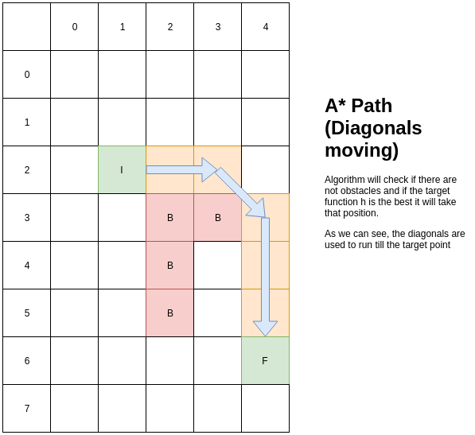

# A* Algorithm
Elegant and simple implementation of A* (A Star) algorithm

## Theory
[https://brilliant.org/wiki/a-star-search](https://brilliant.org/wiki/a-star-search/)

## How to use
You can implement a simple A* strategy using builder pattern like this
```java
    AStar
        .builder(8,5)   //Dimension of search plane
            .from(2,1)  //Initial point
            .to(6,4)    //Target point
            .canMoveOverDiagonals()
            .withObstacles(new int[][]{{3, 2}, {3, 3}, {4, 2},{5,2}})
        .create()
    .findPath()
    .forEach(System.out::println);
```

## Tests
Please see all the tests [here](./src/test/unitTest/java/dev)

Run it using 
```bash
./gradlew unitTest
```
## Issues
Bugs? ugh...well, please write me at yogonza524@gmail.com